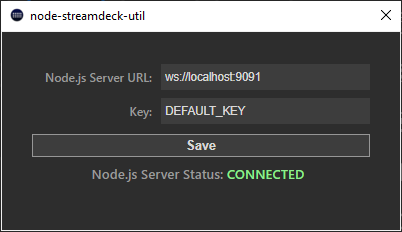

# node-streamdeck-util

*Bundle still under heavy development, use it at your own risk!*

Node.js package to help you interface with a Stream Deck plugin in an external script.

This package is intended to help you develop your own Node.js based applications that interact with a Stream Deck plugin while not being limited to their choice of backends. The included barebones plugin in the `streamdeck-plugin` folder is coded to bridge the connection between the Stream Deck software and this package.

This documentation will not teach you how to use/build upon the plugin or code for the Stream Deck SDK; see the [Stream Deck SDK documentation](https://developer.elgato.com/documentation/stream-deck/sdk/overview/) instead.

Inside the included plugin, in the default Property Inspector for each action, you will find a "Open Settings Dialog" button, which will open a window where settings relating to the connection to the Node.js application can be changed.



Currently this bundle is only designed/tested to work with the full sized Stream Deck with 15 LCD keys; the Stream Deck Mini with 6 LCD keys may also work but not guaranteed.

### Example

#### JavaScript

```javascript
var StreamDeck = require('./dist/index');

var sd = new StreamDeck({
  key: 'EXAMPLE_KEY',
  port: 1234,
  debug: true
});

sd.on('open', () => {
  console.log('open');
});
sd.on('close', (code, reason) => {
  console.log('close: %s, %s', code, reason);
});
sd.on('error', (err) => {
  console.log('error:');
  console.log(err);
});
sd.on('message', (msg) => {
  console.log('message:');
  console.log(msg);
});
```
