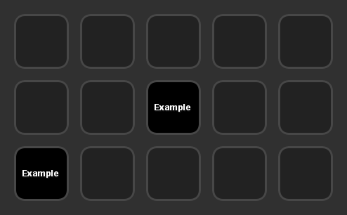

# node-streamdeck-util

*Package still under heavy development by someone who doesn't usually make packages, use it at your own risk!*

Node.js package to help your Node.js scripts easily interface with an official Stream Deck application plugin.

This package is intended to help you develop your own Node.js based applications that interact with a Stream Deck plugin while not being limited to their choice of backends. The included barebones plugin in the `streamdeck-plugin` folder is coded to bridge the connection between the Stream Deck software and this package.

This documentation will not teach you how to use/build upon the plugin or code for the Stream Deck SDK; see the [Stream Deck SDK documentation](https://developer.elgato.com/documentation/stream-deck/sdk/overview/) instead.

Inside the included plugin, in the default Property Inspector for each action, you will find a "Open Settings Dialog" button, which will open a window where settings relating to the connection to the Node.js application can be changed.


Currently this package is only designed/tested to work with the full sized Stream Deck with 15 LCD keys; the Stream Deck Mini with 6 LCD keys may also work but not guaranteed.

Technically, this package sets up a simple WebSocket server that the barebones plugin in the `streamdeck-plugin` folder is set up to send/receive messages from, essentially bridging the gap between to two instead of directly connecting to their own WebSocket, but being able to code as if it was the same one.

## Install

`$ npm install streamdeck-util --save`

### Example

#### JavaScript

```javascript
var StreamDeck = require('streamdeck-util');

// Create new instance of the utility.
var sd = new StreamDeck();

// Start listening for connections from the Stream Deck plugin.
// key - the secret key to authenticate the connection, defaults to DEFAULT_KEY
// port - the port the connection will use, defaults to 9091
// debug - if you want to print debug messages, useful for development
sd.listen({
  key: 'EXAMPLE_KEY',
  port: 1234,
  debug: true
});

// When the connection between the plugin and this instance is open.
sd.on('open', () => {
  console.log('open');
});

// If the connection between the plugin and this instance is closed.
sd.on('close', (code, reason) => {
  console.log('close: %s, %s', code, reason);
});

// If there are any errors on the connection between the plugin and this instance.
sd.on('error', (err) => {
  console.log('error:');
  console.log(err);
});

// Listens for the Stream Deck's events.
sd.on('message', (msg) => {
  console.log('message:');
  console.log(msg);
  
  var buttonLocations = sd.getButtonLocations(); // object, see below
  var pluginUUID = sd.getPluginUUID(); // sometimes needed as context when sending messages
  
  // Send a message back to the Stream Deck application; the send function stringifies it for you.
  sd.send({
    event: 'openUrl',
    payload: {
      url: 'https://www.elgato.com'
    }
  });
});

// You can directly listen for Stream Deck's events by their name if you want to.
sd.on('keyDown', (msg) => {
  console.log('keyDown:');
  console.log(msg);
});
```

### Button Locations

Because of how you may not have a constant connection to the Stream Deck application to be able to receive all of the `willAppear`/`willDisappear` messages and so on, the barebones plugin included keeps track of the location of the buttons along with other things, for example the title. This is updated in this package's side both on initial connection and any time it changes on the plugin side.

This is an object, that stores the locations of currently visible buttons related to the connected plugin, structured like this...

```
{
  'DEVICE_ID': {
    'ROW_NUMBER': {
      'COLUMN_NUMBER': {
        context: 'CONTEXT_ID',
        action: 'ACTION_ID',
        title: 'BUTTON_TITLE',
        isInMultiAction: true/false, (see SDK README)
        state: 0-based value, (see SDK README)
        titleParameters: object (see SDK README)
      }
    }
  }
}
```

By default, every button location is defined as `null`.

Example in software:



Example object:
```
{
  '5EC4F4448895B7B97547FDA7E8090A2D': {
    '0': {
      '0': null,
      '1': null,
      '2': null,
      '3': null,
      '4': null
    },
    '1': {
      '0': null,
      '1': null,
      '2': {
        context: '043F87C7ED1F69CE6CD660EA20773405',
        action: 'com.zoton2.example.action',
        title: 'Example',
        isInMultiAction: false,
        state: 0,
        titleParameters: {
          fontFamily: '',
          fontSize: 9,
          fontStyle: '',
          fontUnderline: false,
          showTitle: true,
          titleAlignment: 'middle',
          titleColor: '#ffffff'
        }
      },
      '3': null,
      '4': null
    },
    '2': {
      '0': {
        context: '043F87C7ED1F69CE6CD660EA20773405',
        action: 'com.zoton2.example.action',
        title: 'Example',
        isInMultiAction: false,
        state: 0,
        titleParameters: {
          fontFamily: '',
          fontSize: 9,
          fontStyle: '',
          fontUnderline: false,
          showTitle: true,
          titleAlignment: 'middle',
          titleColor: '#ffffff'
        }
      },
      '1': null,
      '2': null,
      '3': null,
      '4': null
    }
  }
}
```
